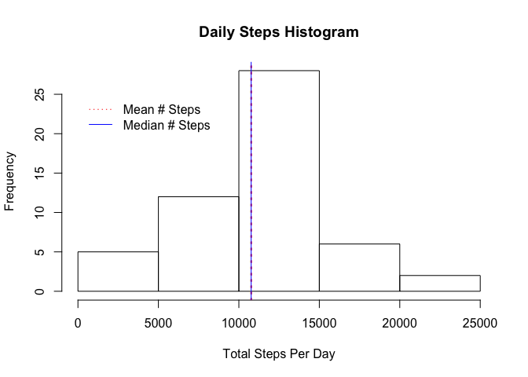
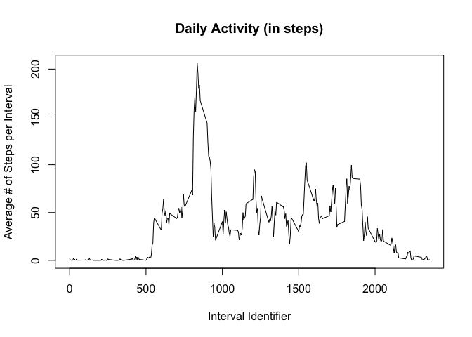
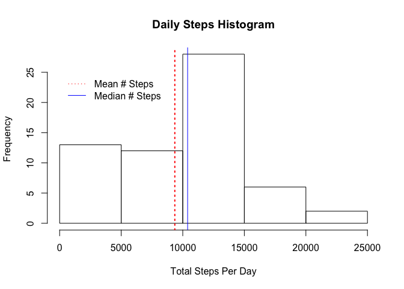
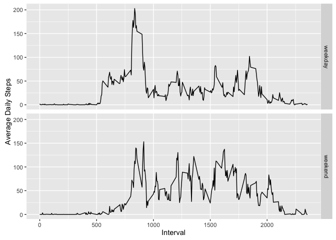

# Reproducible Research: Peer Assessment 1


## Load and preprocess the data
The following code is used to load and process the data provided for this project. The data file, "activity.zip" was first unzipped to product "activity.csv", which is loaded and preprocessed below.


```r
stepData <- read.csv("activity.csv", colClasses = c("integer", "Date", "integer"))
```


## Calculate the total, mean and median number of steps per day
To simplify things, use the dplyr package to create the dailyTotals data frame, which contains the total number of steps for each date in our data set.


```r
library(dplyr)
```


```r
stepData <- arrange(stepData, date, interval) %>% group_by(date)
dailyTotals <- summarize(stepData, daily.total=sum(steps))
meanDailyTotal <- as.integer(mean(dailyTotals$daily.total, na.rm = TRUE))
medianDailyTotal <- as.integer(median(dailyTotals$daily.total, na.rm = TRUE))
```


The **mean number of steps taken per day** = 10766

The **median number of steps taken per day** = 10765

The following histogram visualizes the **freqency of total daily steps**:

```r
hist(dailyTotals$daily.total, main = "Daily Steps Histogram", xlab = "Total Steps Per Day")
abline(v=meanDailyTotal, lty=3, lwd=2, col="red")
abline(v=medianDailyTotal, lwd=1, col="blue")
legend(x=0, y=25, legend=c("Mean # Steps", "Median # Steps"), lty=c(3, 1), col=c("red", "blue"), bty="n")
```

<!-- -->


## Calculate the daily activity pattern
The following code creates a data frame containing the average steps taken in each measured interval. The average is calculated across all days during which measurements were taken.


```r
stepDataIntervals <- mutate(stepData, interval=as.factor(interval)) %>% 
    group_by(interval)
intervalAvgs <- summarize(stepDataIntervals, average.steps=mean(steps, na.rm=TRUE))
maxInterval <- intervalAvgs[intervalAvgs$average.steps == max(intervalAvgs$average.steps), ]$interval
```


The following plot visualizes the daily activity (based on the average steps taken per interval).

The **interval containing the most steps (on average)** is: 835


```r
plot(intervalAvgs$interval, intervalAvgs$average.steps, type="l", xlab="Interval Identifier", ylab="Average # of Steps per Interval", main="Daily Activity (in steps)")
```

<!-- -->


## Imputing missing values

```r
numMissingValues <- nrow(stepData[is.na(stepData$steps), ])
```
There are **2304 missing step measurements** in the data set provided.


```r
medianSteps <- median(stepData$steps, na.rm = TRUE)
```
The **median # of steps, calculated across all measurements taken** (with missing values ignored), is: **0**

So, let's replace the missing values with the median # of steps:

```r
stepData2 <- mutate(stepData, steps=replace(steps, is.na(steps), medianSteps))
```

To see the impact of imputing missing values in our dataset with the mean, let's recalculate the total, mean and median number of steps per day; and then recreate our histogram.

Note that we no longer need "na.rm = TRUE" in the mean and median calculations.


```r
stepData2 <- arrange(stepData2, date, interval) %>% group_by(date)
dailyTotals2 <- summarize(stepData2, daily.total=sum(steps))
meanDailyTotal2 <- as.integer(mean(dailyTotals2$daily.total))
medianDailyTotal2 <- as.integer(median(dailyTotals2$daily.total))
```

*With imputed values*, the **mean number of steps taken per day** = 9354

*With imputed values*, the **median number of steps taken per day** = 10395

*Now with imputed values*, this histogram visualizes the **freqency of total daily steps**:

```r
hist(dailyTotals2$daily.total, main = "Daily Steps Histogram", xlab = "Total Steps Per Day")
abline(v=meanDailyTotal2, lty=3, lwd=2, col="red")
abline(v=medianDailyTotal2, lwd=1, col="blue")
legend(x=0, y=25, legend=c("Mean # Steps", "Median # Steps"), lty=c(3, 1), col=c("red", "blue"), bty="n")
```

<!-- -->

The impact of our strategy for imputing values appears to be minimal.

## Are there differences in activity patterns between weekdays and weekends?
We'll need to categorize the daily activity by weekdays and weekends. I used the lubridate package to help with this.


```r
library(lubridate)
```

```r
dayType = factor(c("weekend", "weekday", "weekday", "weekday", "weekday", "weekday", "weekend"))
stepData2 <- mutate(stepData2, day.type=dayType[wday(date)])
stepData2 <- group_by(stepData2, day.type, interval)
stepData2Avgs <- summarize(stepData2, mean.steps=mean(steps))
```


```r
library(ggplot2)
```

```r
activityPlot <- ggplot(stepData2Avgs, aes(interval, mean.steps))
activityPlot + geom_line() + facet_grid(day.type ~ .) + labs(x="Interval", y="Average Daily Steps")
```

<!-- -->

It appears that the volunteer was, on average, more active on weekends than weekdays. If this were me, it would make sense. During weekdays, I'm working hard, but glued to my office chair for the most part. On the weekends, I'm much more moble (when it comes to daily steps).

